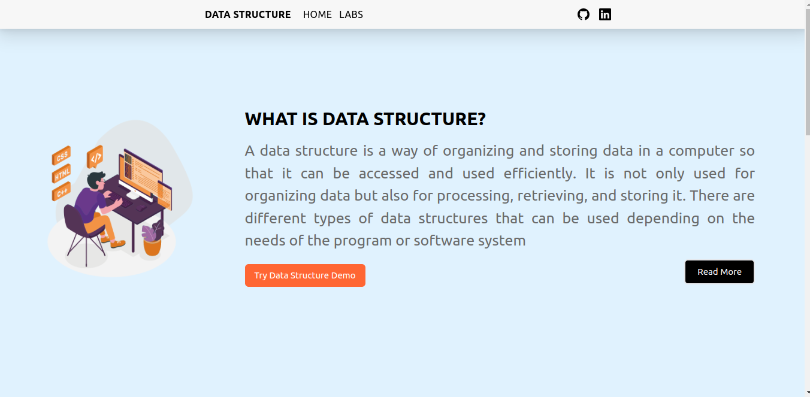

# Data-Structure

This Vite project was created for a college Skill-X presentation, but I decided to make it realistic and host it.

## Introduction

This project aims to demonstrate various data structures using Vite.js, Tailwind CSS, React Router. Contributions are welcome! If you have new ideas or improvements, please feel free to share them with me.




## Prerequisites

Before you begin, ensure you have met the following requirements:

- **Node.js**: Make sure Node.js is installed on your system. You can download it from [nodejs.org](https://nodejs.org/).

## Local Setup

To set up this project locally, follow these steps:

1. Clone the repository:
  ```sh
   git clone https://github.com/your-username/data-structure.git
  ```

Replace your-username with your GitHub username.

2. Navigate to the project directory:

```sh
cd data-structure
```

3. Install dependencies:

```sh
npm install
```

4. Start the development server:

```sh
npm run dev
```

This will start the development server, and you can view the project in your browser at http://localhost:3000.

## Contributing

We welcome contributions from the community! If you find a bug or have an idea for an improvement, please open an issue or submit a pull request. To contribute to this project, follow these steps:

### Fork the repository:

Click the "Fork" button at the top right corner of this repository to create your copy.

### Clone your fork:

```sh
git clone https://github.com/your-username/Debangan2020-Data-Structure.git
```

Replace "your-username" with your GitHub username.

### Create a new branch:

```sh
git checkout -b feature/your-feature-name
```

Replace "your-feature-name" with a descriptive name for your feature or bug fix.

### Make your changes:

Make your changes in the new branch. Test your changes locally to ensure they work as expected.

### Commit your changes:

```sh
git commit -m "Add your descriptive commit message here"
```

### Push to your fork:

```sh
git push origin feature/your-feature-name
```

### Create a pull request:

- Go to the original repository.
- Click on the "New Pull Request" button.
- Select your branch and create the pull request.

We appreciate your contributions!

## File Structure

```
data-structure/
├── public/
│   │   └── images/
│   │       └── data.png
│   │       └── data1.png
│   │       └── R.png
├── src/
│   ├── components/
│   │   ├── Body.jsx
│   │   ├── dropdown.jsx
│   │   ├── Home.jsx
│   │   ├── Lab.jsx
│   │   ├── Module1.jsx
│   │   └── Module2.jsx
│   │   └── Navbar.jsx
│   │   └── Read.jsx
│   ├── routes/
│   │   ├── root.jsx
│   ├── error-page.jsx
│   ├── index.css
│   └── main.jsx
├── .gitignore
├── package.json
├── README.md
├── index.html
└── ...
```

1. #### `public/:`

This directory contains static files that will be served as it is. The data.png file is an example of an image that the project uses. Files placed here will be accessible directly from the root URL of your application.

2. #### `src/:`

This is where your source code resides.

  - **components/**: Reusable UI components of your application. For instance, Navbar.jsx might contain the code for the header component used across multiple pages.

  - **routes/**: Each .vue or .jsx file inside this directory represents a different page or route in your application. For example, Home.vue might be the component for the home page.

3. #### `.gitignore:` 

This file specifies files and directories that Git should ignore. For example, you might ignore node_modules/ directory to avoid pushing dependencies to github or version control system.

4. #### `package.json:`

The configuration file for your project. It includes metadata about the project and a list of dependencies (node packages) required for the project.

5. #### `README.md:`

The README file provides information about your project, including how to set it up, contribute, and any other important details.

## Live Demo

Check out the live demo of this project [here](https://data-structure-skill.netlify.app/).
